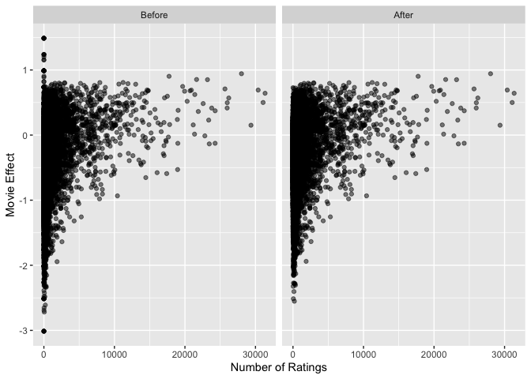

Modeling Movie Recommendations
================
Andrew Hayes
10/3/2019

-   [Overview](#overview)
-   [Methods](#methods)
    -   [Data Preparation](#data-preparation)
    -   [Measuring Effectiveness](#measuring-effectiveness)
    -   [Models](#models)
        -   [Simple Average Model](#simple-average-model)
        -   [Movie and User Effects Model](#movie-and-user-effects-model)
        -   [Regularized Movie and User Effects Model](#regularized-movie-and-user-effects-model)
        -   [Recommender Lab: UBCF, IBCF, and SVD](#recommender-lab-ubcf-ibcf-and-svd)
-   [Results](#results)
    -   [Including Effects](#including-effects)
    -   [Personalization with Recommender Lab](#personalization-with-recommender-lab)
        -   [Tuning and RMSEs](#tuning-and-rmses)
        -   [Changed Recommendations](#changed-recommendations)
-   [Conclusion](#conclusion)

Overview
========

This is a rating prediction project based off of the [Netflix Prize](https://en.wikipedia.org/wiki/Netflix_Prize), in which participants were challenged to surpass Netflix's accuracy in predicting users' movie ratings on the test set. The goal of the competition and of this project was to minimize the prediction error, specifically the root mean-squared error (RMSE). I implemented a series of increasingly complex models on a subset of the [MovieLens dataset](https://grouplens.org/datasets/movielens/10m/) and observe significant decreases in RMSE from a trivial, baseline algorithm.

Methods
=======

### Data Preparation

The 1 million ratings used for this project are a subset of the full 10 million rating [MovieLens dataset](https://grouplens.org/datasets/movielens/10m/). Using the script provided in class, the data was imported from flat files and split into training and test datasets called *edx* and *validation* respectively. Users or movies that occured only in the test set were removed and added back to the training set, to avoid making predictions on net new movies or users.

### Measuring Effectiveness

The main measure of effectiveness across various models was root mean squared error (RMSE) between actual ratings and predicted ratings. Other aspects of the ratings, like the appropriateness of resulting movie recommendations, were also considered.

Models
------

The first three models - simple average, movie and user effects, and regularized movie and user effects - are implementations of the models demonstrated in the edx course *Data Science: Machine Learning*. The last three are exploratory and use the recommenderlab package.

### Simple Average Model

As a baseline model, we minimize RMSE by predicting the global average. In other words, the model assumes that all movies have the same true rating and all variation is independent of movie *i* or user *j*:

*r**i**j* = *μ* + *ϵ**i**j*

### Movie and User Effects Model

In this model we assume each movie and user introduces a deviation or "effect" from the global true rating. The movie effect *m**i* is the average deviation of movie *i* from the global mean, and allows for what we already know: that some movies are better than others (or at least perceived as better). The user effect *u**j* is the average deviation of user *j* from the average rating of each movie they watched, to adjust for the fact that some users rate movies on average more highly than others. Our resulting model is:

*r**i**j* = *μ* + *m**i* + *u**j* + *ϵ**i**j*
$$m\_i = \\frac{1}{n\_i}\\sum\_{k} (r\_{ij\_k} - \\mu) \\qquad \\qquad u\_j = \\frac{1}{n\_j}\\sum\_{k} (r\_{i\_kj} - m\_{i\_k} - \\mu)$$
 where *n**i* and *n**j* represent the number of ratings that a movie or user has.

The movie and user effects model can generate predictions greater than 5 or less than .5, so out-of-range predictions were rounded to 5 or .5.

### Regularized Movie and User Effects Model

An extension of the Movie + User Effects Model, the regularized extension recognizes that a simple mean to determine movie or user effects can have negative results in prediction on the test set due to small sample sizes in the training set. For example, if one and only one person rates movie *i* in the training set and that rating is a 5, that *m**i* is going to indicate a very good movie when it may not be. To regularize for small sample sizes, we introduce terms *λ**m* and *λ**u* when calculating effects to reduce them disproportionately for small samples:

$$m\_i = \\frac{1}{n\_i + \\lambda\_m}\\sum\_{k} (r\_{ij\_k} - \\mu)  \\qquad \\qquad u\_j = \\frac{1}{n\_j + \\lambda\_u}\\sum\_{k} (r\_{i\_kj} - m\_{i\_k} - \\mu)$$
 The values of the *λ*'s were determined by minimizing RMSE on the training set with cross-validation (*k* = 10). When creating the folds, users or movies who appreared in the test folds but not their respective training sets were removed to the training sets, just as was done with the actual test set during data preparation. After applying the model to each fold, the mean of the 10 RMSE's was calculated and minimized with Nelder-Mead, R's default optimization algorithm.

### Recommender Lab: UBCF, IBCF, and SVD

The recommenderlab R package was used to build more personalized models. The three previous models, while they attempt to minimize the RMSE, cannot be used for personalization. The two effects models differentiate movies but only insofar as one is more highly rated than another, not that Person A might prefer Movie X while Person B might prefer Movie Y. **Note:** These three approaches were not finely tuned, and the only tuning that took place was on the *test* set. This was due to the computational intensiveness of these approaches which makes testing them a very lengthy process. Truly training these models with tune grids and cross-validation would require a more powerful machine in a hosted environment.

For all three recommenderlab models, the data was prepared in the same way. After normalizing and regularizing ratings, the residuals from the 1000 most rated movies and the 1000 users with the most ratings among those movies were used to form a 1000 × 1000 ratings matrix. A second matrix of the 1000 most rated movies and *any* user who had rated *any* of those movies was also created (69871 × 1000), to input to recommenderlab's predict function which attempts to fill in the unknowns in a provided ratings matrix.

A Singular Value Decomposition (SVD), Item Based Collaborative Filtering (ICBF), and User Based Collaborative Filter (UCBF) model were all trained on the 1000 × 1000 matrix. Then, those models were used to predict missing ratings in the 69871 × 1000 matrix. Because Recommender Lab only predicts ratings for items (here movies) it has already seen, they did not make predictions for all ratings in the test set. In the case of ICBF and UCBF, sometimes no ratings were predicted even for movies included in the model when not enough user or movie data was available. Results from the "Regularized Movie and User Effects Model" were interpolated to make a full prediction. All of the recommenderlab modeling can be thought of as an extension, not an alternative the previous model. The recommenderlab predict function is not aware of the limits on our rating scales of 0.5 - 5.0, so ratings outside of that range were adjusted to the border. For more information on the algorithms involved, see [the paper from one of recommenderlab's creator](https://cran.r-project.org/web/packages/recommenderlab/vignettes/recommenderlab.pdf), Michael Hahsler. Singular Value Decomposition was also covered in the edx course *Data Science: Machine Learning*.

Results
=======

The RMSE's for the various models are:

Including Effects
-----------------

The largest improvement by far is from the simple average model to the movie and user effects model. Clearly both movies and users have substantial effects that we benefit by accounting for.

The improvement from regularization was much smaller, less than 10−2. Lambda was optimized via cross-validation at *λ**m* = 4.54399 and *λ**u* = 4.5771. The tuning is visualized here with a tuning grid constructed after the fact, centered at the optimal value:

You can see that the RMSE was relatively more senstive to *λ**u* than *λ**m* and the difference between all choices shown are all small, well within &lt;10−4. The regularization did, however, have an enormous impact on our movie rankings. See the top 20 movies for each model, and the bottom 20 movies for each model, in the tables below. Without regularization, most of the best and worst movies have only a few ratings. With regularization many more familiar movies rise to the top of the charts.

We can also visualize the shift in movie effects by plotting the effects against the number of ratings. Initially there is a large spread in movie effects near *n* = 0, which is reduced with regularization.

Personalization with Recommender Lab
------------------------------------

Recommending the best rated movies is valuable in itself, but ideally recommendations are personalized. The recommenderlab package enabled some personalization and reduced RMSE substantially. **Reminder:** Tuning for these models, what little did take place, was on the test set for expediency and should be interpreted with a grain of salt.

### Tuning and RMSEs

**UBCF:** UBCF was the only algorithm that did not significantly outperform MUFR. Its results were improved by calculating distance between users with Pearson's rather than Cosine's. UBCF is commonly used and known as a top recommendation algorithm, but it is more memory and computationally intensive than SVD or IBCF when making predictions. It took much longer to run and likely needs to be scaled up to be effective.

**IBCF:** The IBCF model outperformed the Regularized Movie and User Effects Model (MUFR). In its default settings IBCF performed quite poorly, but was improved greatly by a) calculating distance with Pearson's rather than Cosine's and b) dramatically increasing *k* from the default 30 to 400. *k* in this algorithm indicates the number of movies similar to movie *i* whose ratings are considered when predicting a rating for movie *i*.

**SVD:** The SVD model also outperformed MUFR. The only tuning that took place was to increase *k* from 10 to 20, where *k* is the number of most significant vector pairs used to estimate the residual. Increasing *k* beyond that yielded some reduction in RMSE but not much, suggesting that the higher-numbered primary components become less relevant and represent noise rather than actual user properties.

### Changed Recommendations

Like with regularization, we can also see a change in movie rankings in addition to RMSE. The new models will recommend different top movies (from the top 1000 movies) for each person from the list of movies they have not rated. In tables 5 and 6, the top five recommendations for two users are arranged by model. Most of the recommendations are familiar from the overall top 20 movies. The models as tuned reorder recommendations but often respect the overall ranking of movies - in another implemention, this could be changed by weighting the predicted residual higher than the movie effect. In Table 7, we can see that for the 250 users on which we have the most training data, the median movie rank of their recommendations increases with the personalized models as expected.

Conclusion
==========

By modeling the differences in movies, user averages, and user preferences, we substantially decreased our RMSE. Modeling movie and user effects reduced the RMSE from a baseline 1.061 by over 18% to 0.8651. Regularizing effects granted a further reduction to 0.8647 and incorporated sample size into our movie rankings for better recommendations. The Regularized Effects model has the benefit of scaling well but unfortunately does not offer personalized recommendations. It would recommend all users the same top movies. A user could just as easily look up the top movie list on IMDb. There is an industry imperative to personalize recommendations based on the residuals of the Regularized Effects model.

An exploratory step in that direction was taken by using the recommenderlab package to test different models for user preferences. Substantial improvements in RMSE were seen with relatively small models and little tuning. The next step would be to test and tune with recommenderlab in a more robust fashion. First, the modeling should move to a hosted environment (rather than a local machine) with more computational power and in-memory capacity. Second, parameter tuning should take place on the training set via cross-validation rather than on the test set. Specifically, the parameters to tune are the number of movies in the model, the number of users in the model, and the parameters specific to each algorithm. Third, an ensemble of the various methods should be built and optimized to further reduce error.
